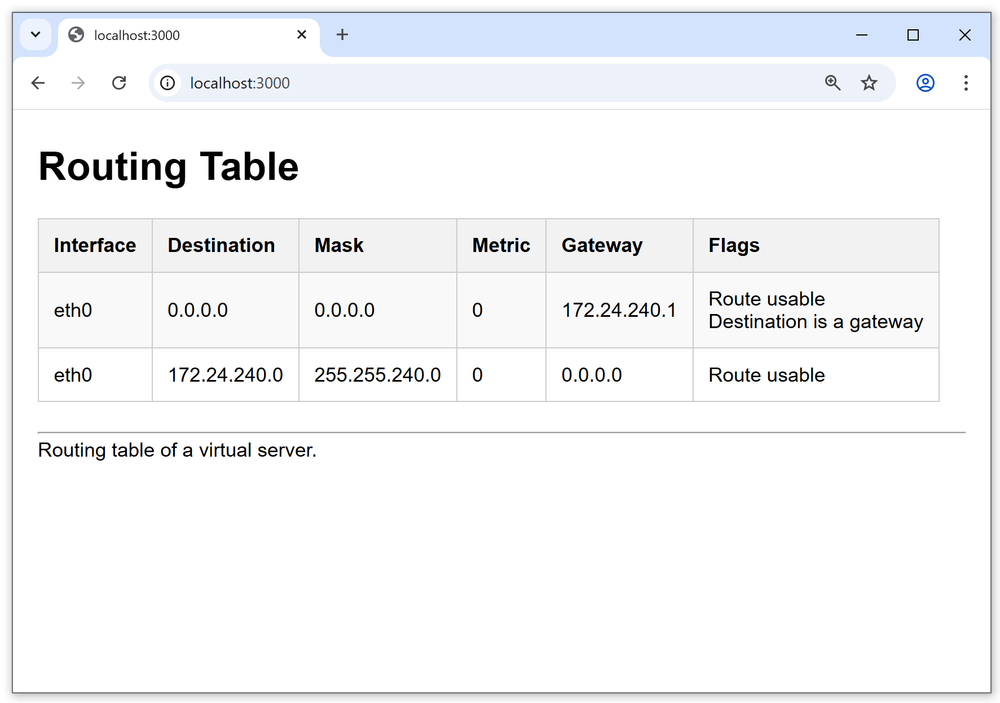
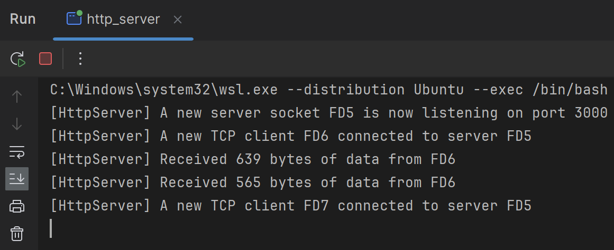

# KIV/PSI 2024 - SP#1

# Úvod
První semestrální práce z předmětu KIV/PSI, ZS2024.

Aplikace zobrazující Linux Routing tabulku ve formě HTML. Server je spuštěn na portu 3000.
# Použité technologie
* Jazyk: C++17
* Build systém: CMake

# Kompilace a spuštění
## Příkazy
* Nejdříve je potřeba inicializovat CMake pomocí:
  
`cmake -S . -B "build"`

* Poté je možné provést kompilaci pomocí:

`cmake --build ./build`

* Spustitelný soubor se nachází v:

`./build/src/http_server`

## Testovací prostředí
Aplikace úspěšně zkompilována a spuštěna s následujícími verzemi sw:
* `Ubuntu 22.04.3 LTS (GNU/Linux 5.15.153.1-microsoft-standard-WSL2 x86_64)`
* `CMake 3.22.1`
* `G++ 11.4.0 (GCC 11.4.0) Copyright (C) 2021 Free Software Foundation, Inc.`

# Moduly projektu
* epoll-cpp
  * Jednoduchá knihovna sloužící jako wrapper okolo Linux Epoll API
  * Efektivní event-driven architektura která může asynchroně obsluhovat velké množství klientů
  * https://en.wikipedia.org/wiki/Epoll
* server
  * Generický HTTP server implementovaný pomocí epoll-cpp knihovny
* user-interface
  * Všechny třídy týkající se fungování uživatelského rozhraní této aplikace

# Soubory projektu
* user-interface
  * HtmlUtils 
    * Soubor obsahující funkce usnadnující formátování HTML elementů
    * constexpr a inline, vyhodnoceno v čase kompilace
  * RoutingTable
    * Obsahuje všechny funkce nutné pro parsing a zobrazení tabulky

# Routovací Tabulka
## Odůvodnění Obsahu tabulky
* Jedna z podmínek je:
> Zobrazujte jen „použitelné“ záznamy, na základě kterých je prováděn forwarding paketů"
* To znamená že z tabuky musíme vyřadit všechny záznamy, co mají ve sloupci `Gateway` adresu `00000000`, nýbrž tyto záznamy se nepoužívají pro "Forwarding packetů", ale jen pro odeslání rámce cílovému zařízení na L2 co se nachází v síti, která je přímo připojená na daný interface
* Forwarding samotný se provádí i na L2 ("frame forwarding"), zde jde ale o L2 PDU "frame", tedy "rámec" a ne "packet" (tzn. "packet forwarding" probíhá jen na L3)
* https://www.geeksforgeeks.org/frame-forwarding-methods-on-switches/

## Formát souboru `/proc/net/route`
První řádek je vždy záhlaví ve formátu:
`Iface\tDestination\tGateway\tFlags\tRefCnt\tUse\tMetric\tMask\tMTU\tWindow\tIRTT`

Jednotlivé položky tabulky jsou:
* `Iface` - ASCII String
* `Destination` - IPv4 Hex string
* `Gateway` - IPv4 Hex string
* `Flags` - Decimal (?)
* `RefCnt` - Decimal 
* `Use` - Decimal 
* `Metric` - Decimal 
* `Mask` - IPv4 Hex string
* `MTU` - Decimal
* `Window` - Decimal 
* `IRTT` - Decimal 

### Parsing `/proc/net/route`
* Vhodné je tedy "soubor" přečíst po řádkách, separator mezi položkami řádky je vždy whitespace.
* Položky řádky jsou vždy jeden ze tří typů: ASCII String / IPv4 Hex string / Decimal
* První řádka je výjimka kde všechny položky jsou ASCII String
* U následujích řádek je typ položky vždy pevně dán dle její pozice
* Nutno implementovat:
  * Převod IPv4 Hex string na běžný IPv4 formát
  * Převod Flags čísla na string odpovídající flagu

# Ukázka
* Webové rozhraní (pro ukázku zahrnuto i 0.0.0.0)

* Logging operací serveru

